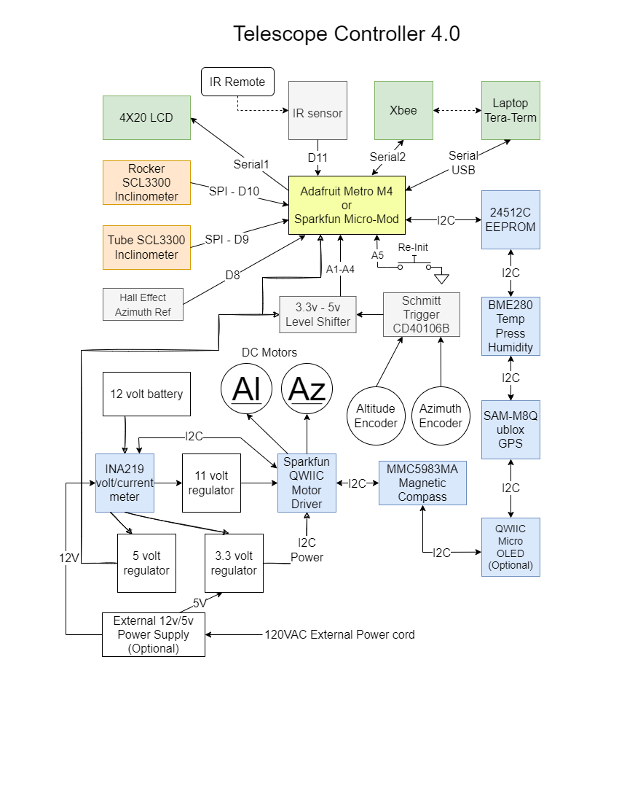

# SAMDTelescopeController

## Arduino SAMD51-based Telescope Controller 4.00.00

#### By David Armstrong, July 2023
 - See MIT LICENSE file

========================================================================

Note: This project is unfinished, although most of the work has been done.  I'm making it public 
so others can build on this framework. I'll continue to improve it, as I'm able to squeeze out
a few precious milliseconds over the coming months and years.

This repository implements one of many possible design scenarios for a Telescope Controller, 
using the Arduino IDE as a development environment.  It's purpose is to allow me, personally,
to use my telescope to look at stuff, instead of spending a lot of time setting it up.

I'm making this available for others to use as a reference in designing their own systems.  As
such, feel free to clone it and change as your needs dictate.

## Organization of the Repository

There are several directories in this project, each containing relevant information and code:

 - docs : Nearly all related documentation files for the system. (The Arduino sketches have their own Readme files.) There is a Draw.io based PNG image file showing the basic buiding blocks that make up the system, and how all the parts communicate with each other.
 - Arduino_Telescope_Interface : Eagle schematic of how to connect various interfaces.  If you have the Eagle PCB software installed, this directory should be copied to be a subdirectory under the EAGLE/projects/ directory.
 - TC4_0diagnostics : Arduino sketch designed to be used as a precursor sketch to TC4_0.  It's purpose is to help make sure all the needed software libraries are installed, and that the associated required hardware is present and working. (Completed)
 - TC4_0 : Arduino SAMD51 processor based Telescope Controller 4.00.00 sketch, that is the Telescope Controller program itself. (Still under development)
 
 
 
 <object data="Arduino_Telescope_Interface/Telescope_Interface_shield.pdf" type="application/pdf" width="700px" height="700px">
    <embed src="Arduino_Telescope_Interface/Telescope_Interface_shield.pdf">
        
Please download the Hardware Schematic PDF to view it: <a href="Arduino_Telescope_Interface/Telescope_Interface_shield.pdf">Hardware Schematic PDF</a>.

    </embed>
</object>